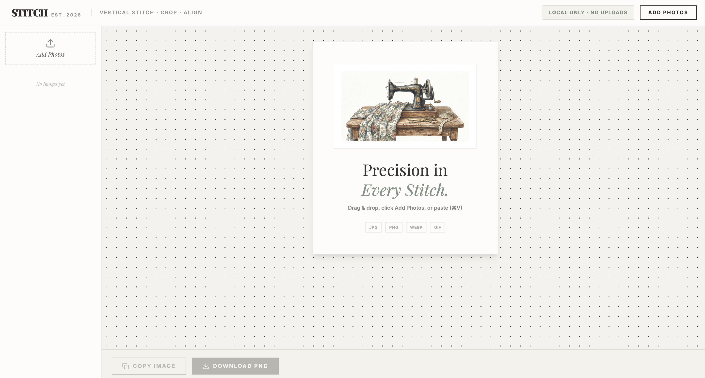

# STITCH · 图片拼接与裁剪

把多张截图或照片拼成一张图。支持横向、纵向拼接和边缘裁剪，适合整理聊天记录、文章截图、图片对比与灵感素材。

**[打开网站，开始使用 →](https://xuyiwenw-lang.github.io/stitch/)**

无需安装或注册，图片在浏览器本地处理，不上传到服务器。

## 三步完成拼接

### 1. 添加图片

点击 **Add Photos** 选择图片，也可以直接拖入网页，或粘贴剪贴板中的图片（Mac：`⌘V`；Windows：`Ctrl+V`）。支持 JPG、PNG、WEBP、GIF 等常见格式，界面支持最多 15 张图片。

### 2. 调整拼接效果

| 想要做什么 | 如何操作 |
| --- | --- |
| 调整顺序 | 在左侧列表拖动图片，按希望的顺序排列 |
| 切换横向／纵向 | 添加图片后，点击预览区左上角的方向按钮 |
| 裁掉多余内容 | 选中图片，拖动预览图的上、下、左、右边缘 |
| 恢复某一侧裁剪 | 双击对应边缘 |
| 放大查看细节 | 使用预览区右下角的缩放滑块或加减按钮 |
| 移除图片／重新开始 | 点击缩略图上的 **×**，或选择 **Clear All** |

### 3. 复制或下载

- **Copy Image**：复制拼接结果，方便粘贴到聊天或文档中。
- **Download PNG**：将拼接结果保存为 PNG 图片。

## 使用小提示

- 纵向拼接会自动统一图片宽度；横向拼接会自动统一高度。
- 预览缩放只影响查看大小，不改变导出图片的尺寸。
- 如果浏览器阻止复制，请使用 **Download PNG**。
- GIF 会作为静态图片拼接，导出结果不保留动画。
- 刷新或关闭页面前记得导出，当前编辑内容不会自动保存。
